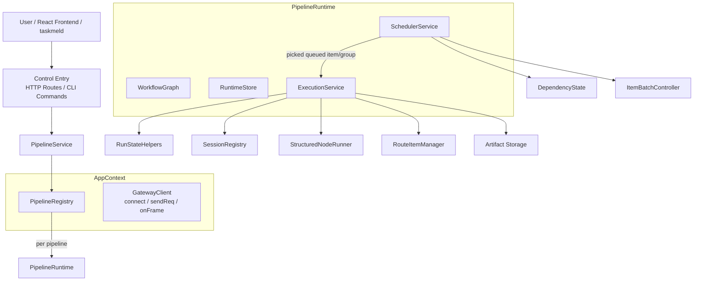

# Runtime Architecture

## Core Concepts

### Workflow

Each pipeline's workflow definition is stored independently as `.data/pipelines/{pipelineId}/workflow.json`, version `"3.0"`. The default fallback path is `.data/pipeline-template.json`.

```
WorkflowDefinitionRuntime
├── version: "3.0"
├── scheduler: WorkflowScheduler
├── plugins: WorkflowPlugins
├── output: WorkflowOutputConfig
├── nodes: WorkflowNode[]
├── edges: WorkflowEdge[]
└── groups: WorkflowGroup[]
```

### Node (WorkflowNode)

| Property | Type | Description |
|------|------|------|
| `id` | string | Unique node identifier |
| `name` | string | Node display name |
| `type` | string | Node type, default "task" |
| `enabled` | boolean | Whether enabled; disabled nodes are simply skipped |
| `isMainline` | boolean | Whether this is a mainline node |
| `lane` | "main" \| "branch" | The lane the node belongs to |
| `executor` | NodeExecutor | Executor configuration (agentId, role, fallbackAgentId, sessionId) |
| `parallelGroupId` | string\|null | Parallel group ID this node belongs to |
| `dependencyPolicy` | "all" \| "any" | Dependency policy |
| `routePolicy` | WorkflowRoutePolicy\|null | Route policy |
| `retryPolicy` | WorkflowRetryPolicy | Retry policy |
| `outputSpec` | OutputSpec | Output specification declaration |
| `allowReject` | boolean | Whether to allow rejecting upstream |
| `maxRejectCount` | number | Maximum reject count |

### Node Type System

| type | Description | inputMode | outputMode |
|------|------|-----------|------------|
| `task` | General-purpose task node (default) | single/batch | single/array |

### Role System (ExecutorRole)

```
"planner"  — Requirements analysis / planning
"coder"    — Code generation
"tester"   — Test verification
"reviewer" — Review and approval
"operator" — Operations
```

### Node Hierarchy (lane)

```
Nodes
├── Mainline nodes (lane="main")
│   └── Participates normally in DAG topology, artifact propagation, and dependency resolution
└── Branch nodes (lane="branch")
    └── Nodes with non-null scope (determined by scope propagation algorithm); branches are isolated from each other
```

### Edge (WorkflowEdge)

```
WorkflowEdge
├── from: string          // Source entity ID (node or parallel group)
├── to: string            // Target entity ID
└── when: string | null   // null = normal dependency edge, non-null = route edge
```

- **Normal dependency edge** (`when === null`): Expresses the topological constraint "B must execute only after A completes".
- **Route edge** (`when !== null`): Expresses branching semantics; the target is only enqueued when the source node's route value matches.

### Parallel Group (WorkflowGroup)

```
WorkflowGroup
├── id: string
├── type: "parallel"
├── members: string[]
└── joinPolicy: "all" | "any" | "quorum"
```

> **Note**: Currently, `any`/`quorum` semantics are not implemented at the execution layer; group behavior always follows `all`.

### Run Instance (Run)

```
Run
├── id: string                     // Run ID
├── status: RunStatus              // "running" | "success" | "failed"
├── nodes: NodeRun[]               // Node run instances (aggregated view)
├── itemRuns?: NodeItemRun[]       // Node-item granularity run instances
├── groups?: GroupRun[]            // Parallel group run instances
└── groupItemRuns?: GroupItemRun[] // Parallel group-item granularity run instances
```

---

## Full Architecture Diagram



---

## DAG Construction Process

### Loading Workflow Definition

```
Disk file (.data/pipelines/{pipelineId}/workflow.json)
    → readWorkflowDefinitionFromRaw()
    → normalize all nodes/edges/groups
    → validateWorkflowGraph() validation:
        ├── Non-empty node list
        ├── Node ID uniqueness
        ├── Valid edge references
        ├── Self-loop detection
        ├── Duplicate edge detection
        ├── Forbid same node emitting both dependency and route edges
        ├── Parallel group members must exist
        ├── No direct dependencies between members
        ├── Parallel groups cannot connect directly to member nodes
        ├── Forbid entry nodes pointing to group members (except when entry is router)
        ├── joinPolicy must be "all"
        ├── Invalid dependencyPolicy value detection
        ├── Cross-branch connection detection (scope-based)
        ├── Route set size validation (2-5)
        └── Cycle detection (Kahn topological sort algorithm)
```

### Runtime Graph Index

`createWorkflowGraph()` builds the runtime graph index:

```
buildIndices(workflow)
├── nodeById: Map<id, WorkflowNode>
├── incomingEdgesByTarget: Map<targetId, WorkflowEdge[]>
├── outgoingEdgesBySource: Map<sourceId, WorkflowEdge[]>
├── groupById: Map<groupId, WorkflowGroup>
├── parallelGroupByMemberNodeId: Map<nodeId, WorkflowGroup>
├── nodeScopes: NodeScopeMap          // Node branch scope cache
└── groups: WorkflowGroup[]
    (supports explicit declarations + inferred from parallelGroupId)
```

> `nodeScopes` is precomputed by `computeNodeScopes()` during index construction. Both `isBranchNode` and `isCrossBranchEdge` perform O(1) lookups based on scope.

---

## Error Handling and Retry

### Node Retry

- Each `WorkflowNode` configures `retryPolicy.maxAttempts` (default 2, range 1-10)
- Exceeding the limit → `item.status = "failed"`

### Reject Mechanism

Downstream nodes can reject upstream nodes (via `envelope.error.code === "upstream_reject"`):

```
handleNodeReject(node, envelope)
├── rejectCount += 1
├── if rejectCount > maxRejectCount → node.status = "failed", return
├── Determine reject target (explicit targets or pickDefaultRejectTarget)
├── Target empty → node.status = "failed", return
├── markNodeRejected
├── for each target:
│   ├── Append rejectFeedback (keep latest 5 entries)
│   ├── Archive existing artifacts to rejected directory
│   └── resetAffectedDownstreamNodes (reset downstream subgraph)
└── return (scheduler auto-advances drainPipeline on next tick)
```

### Hard Failure vs Soft Failure

| Type | Trigger Condition | Behavior |
|------|---------|------|
| Hard failure (haltPipeline=true) | Exception thrown, session not found | Stop the entire scheduling loop |
| Soft failure (haltPipeline=false) | Business status=failed, reject | Only mark current node as failed, scheduling continues |

---

## Persistence

### Runtime State

After each `emitPipeline()` trigger, the `Run` object is asynchronously written to `.data/pipelines/{pipelineId}/run-state.json`.

### Workflow Definition

Each pipeline is independently stored at `.data/pipelines/{pipelineId}/workflow.json`, version `"3.0"`. The default fallback path `.data/pipeline-template.json` is used when no `workflowFilePath` is provided.

### Session Management

`SessionRegistry` maintains the mapping from agents to sessions:

```
resolveExecutorSession(node)
├── 1. pinned sessionId? → Return directly
├── 2. Local cache? → Return
├── 3. fallbackAgentId? → Try
├── 4. refreshSessionsFromGateway() → Reload
└── 5. Retry → Return or null
```

The environment variable `OPENCLAW_AGENT_SESSION_MAP` can pre-inject agent-session bindings.
